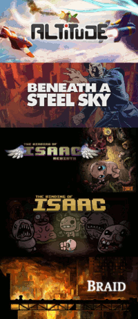

Lauhdutin
==
A Rainmeter skin for launching games.

# Contents
 - [Requirements](#requirements)
 - [Installing](#installing)
 - [Changelog](#changelog)
 - [License](#license)

# Requirements
Developed with the following software in mind:
 - [Rainmeter 4.0 or later](https://www.rainmeter.net/)
 - [Python 3.5 or later](https://www.python.org/downloads/windows/) \*
 
 \* The embeddable versions of Python do not include the **tkinter** module. The **Browse** buttons in the settings skin do nothing if the **tkinter** module is not present in the Python 3 environment. The rest of Lauhdutin should work just fine, but you will need to either add the **pythonw** executable to the PATH system variable or modify the **Python** variable found in **Settings.ini** and **Main.ini**.

This skin may work with earlier Rainmeter and/or Python versions, but such configurations are not supported.

# Installing
- Install Rainmeter and Python 3 on your system (see [requirements](#requirements) for more info).
- Download a [release](https://github.com/Kapiainen/Lauhdutin/releases).
- Extract the **Lauhdutin** folder into your **\Rainmeter\Skins** folder.
- Load **Settings.ini**, adjust the various settings (e.g. path to Steam) to your liking, click the **Save** button, and finally click the **Exit** button.
- **Main.ini** should now load and will gather information on the games that you have installed. The skin will say **Processing...** for a while as it is e.g. downloading banners for games, but should eventually switch over to showing a list of games that it has found.
- Windows shortcuts (.lnk files) can be added to the **\Lauhdutin\@Resources\Shortcuts** folder.
- Banners for Windows shortcuts and Steam's Non-Steam game shortcuts can be added to the **\Lauhdutin\@Resources\Banners\Shortcuts** and **\Lauhdutin\@Resources\Banners\Steam shortcuts** folders, respectively. The name of the banner should match the name of the .lnk file or the name in Steam, respectively.

# Changelog
**Version 2.0.0 - 2017/01/26:**
- Implemented backend in Python 3:
    - Improved Steam support:
        - Non-Steam game shortcuts added to Steam are now fully supported and are run via the Steam browser protocol.
    - Added support for GOG Galaxy:
        - Can detect games installed via GOG Galaxy.
        - Can download banners automatically.
    - Added support for regular Windows shortcuts (.lnk).
        - Shortcuts are placed in a specific folder and a corresponding banner can be provided in another folder by the user.
- Implemented frontend in Python 3 and Lua:
    - Added secondary skin, which is accessible from the primary skin, for adjusting settings.
        - Menu is capable of showing the Steam persona name linked with the UserDataID for easier configuration.
        - Support for directory dialog when *tkinter* module is available in Python 3 environment.

**Version 1.3.3 - 2016/11/29:**
- Updated the Lua script to more gracefully handle appmanifests that do not conform to the expected structure.
- Updated the section covering the UserDataID setting in the readme.

**Version 1.3.2 - 2016/11/22:**
- Updated the URL used to download banners for games on Steam since the previous URL became obsolete and no longer successfully downloaded banners.

**Version 1.3.1 - 2016/11/05:**
- Updated the VDF parser to process the keys of all key-value pairs in case-insensitive manner. This change should fix the issue of Steam games not showing up for some people.

**Version 1.3.0 - 2015/06/06:**
- Paths to Steam libraries, which exist outside of the folder where Steam is installed, are now automatically read from libraryfolders.vdf, which exists in the SteamApps folder located in the folder where Steam is installed. The SteamLibraryPaths setting is no longer used.

**Version 1.2.1 - 2015/05/03:**
- The toolbar should now hide itself so that it is out of the way when adding games to a skin that currently has no games to show.
- Modified the patterns used when parsing VDF files in order to handle values containing quotation marks.

**Version 1.2.0 - 2015/05/01:**
- Added a new way of adding games. The "Add game" custom skin action opens a menu where one can specify the name, path to the executable, tags (optional), and Steam AppID (optional, used to download the banner) for a game.
- New settings:
  - ToolbarLogoTint
  - AddGameButtonColor
  - AddGameButtonBackgroundColor

**Version 1.1.1 - 2015/04/30:**
- Changed the way that data is retrieved from sharedconfig.vdf and localconfig.vdf.

**Version 1.1.0 - 2015/04/29:**
- Added support for additional Steam libraries that exist outside of the folder where Steam is installed.

**Version 1.0.1 - 2015/04/29:**
- Fixed a bug that caused the script to do unnecessary iterations in a for-loop that would result in an attempt to access a non-existing game object in the table of games.

**Version 1.0.0 - 2015/04/29:**
- Initial release.

# License
See [**License.md**](License.md) for more information.

This software makes use of [json4lua](https://github.com/craigmj/json4lua) ([license](./Lauhdutin/@Resources/Dependencies/json4lua/LICENCE.txt)).
