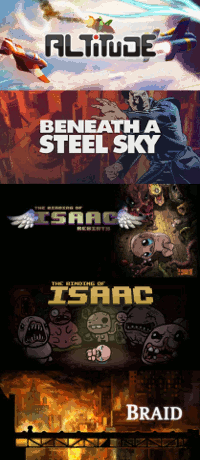

Lauhdutin
==
A Rainmeter skin for aggregating games from different platforms and then launching them. Supports Steam, GOG Galaxy, Battle.net, and regular Windows shortcuts. Games are presented as a scrollable list that can be filtered and sorted in multiple ways. There are a variety of settings that allow you to customize the appearance of the skin (e.g. orientation, number of slots, dimensions of a slot, animations).



[Higher resolution version of the animated GIF](Docs/Demo-original.gif)

# Contents
 - [Requirements](#requirements)
 - [Installing](#installing)
 - [Updating](#updating)
 - [Supported platforms](#supported-platforms)
 - [Filtering](#filtering)
 - [Bangs](#bangs)
 - [Animations](#animations)
 - [Reporting issues](#reporting-issues)
 - [Contributing](#contributing)
 - [Changelog](#changelog)
 - [License](#license)

# Requirements
Developed with the following software in mind:
 - [Rainmeter 4.0 or later](https://www.rainmeter.net/)
 - [Python 3.5 or later](https://www.python.org/downloads/windows/) \*
 
 \* Tick the checkbox on the first screen of the Python installer to add Python to the PATH system variable and make sure that **tkinter** is ticked in the section for optional features. The embeddable versions of Python do not include the **tkinter** module. The **Browse** buttons in the settings skin do nothing if the **tkinter** module is not present in the Python 3 environment. The rest of Lauhdutin should work just fine, but you will need to specify the absolute path to the **pythonw** executable in the settings menu. If you have multiple versions of Python installed (e.g. 2.7 and 3.5), then you may have to specify the absolute path to the **pythonw** executable for 3.5 in the settings menu if the system defaults to 2.7.

# Installing
- Install Rainmeter and Python 3 on your system (see [requirements](#requirements) for more info).
  - [Add Python to the PATH system variable](Docs/PythonStep1.jpg).
  - [Customize the installation](Docs/PythonStep1.jpg).
  - [Install the `tcl/tk and IDLE` optional feature.](Docs/PythonStep2.jpg)
- Download a [release](https://github.com/Kapiainen/Lauhdutin/releases).
- Extract the **Lauhdutin** folder and place it in `\Rainmeter\Skins`.
- Load **Settings.ini**, adjust the various settings (e.g. path to Steam) to your liking (hover over the title of a setting for more information about the setting), click the **Save** button, and finally click the **Exit** button.
- **Main.ini** should now load and will gather information on the games that you have installed. The skin will say `Processing...` for a while. At some point the skin should say `Downloading...` as it is e.g. downloading banners for games, but should eventually switch over to showing a list of games that have been found.
- Windows shortcuts (.lnk and .url files) can be added to the `\Lauhdutin\@Resources\Shortcuts` folder.
- Banners for Windows shortcuts and Steam's Non-Steam game shortcuts can be added to the `\Lauhdutin\@Resources\Banners\Shortcuts` and `\Lauhdutin\@Resources\Banners\Steam shortcuts` folders, respectively. The name of the banner should match the name of the .lnk or .url file, or the name in Steam, respectively.

# Updating
If you are using an older version of Lauhdutin (2.0.0 or newer) and want to update to the latest version, then you have two recommended options:

- Remove the old version completely from `\Rainmeter\Skins` and then proceed with the [normal installation steps](#installing).
- Caution! You will lose:
  - All information regarding total time played that was tracked solely by **Lauhdutin**. Steam tracks this information independently for its games.
  - All settings (e.g. layout, Steam UserDataID, hidden games).

or

- Remove all files from `\Rainmeter\Skins\Lauhdutin` except for the following files and folders:
```
\Rainmeter\Skins\Lauhdutin\@Resources\games.json
\Rainmeter\Skins\Lauhdutin\@Resources\settings.json
\Rainmeter\Skins\Lauhdutin\@Resources\Banners
\Rainmeter\Skins\Lauhdutin\@Resources\Shortcuts
```
- If you are using a Python path that differs from the default value, then do not remove `\Rainmeter\Skins\Lauhdutin\@Resources\PythonPath.inc` either!
- If you are using custom icons (not referring to game banners), then do not remove `\Rainmeter\Skins\Lauhdutin\@Resources\Icons` either!
- Extract the latest version of Lauhdutin over the old version's remaining barebones folder. Do not overwrite `PythonPath.inc`, if you left it intact when removing files and folders. Do not overwrite any custom icons you may have been using either, if you were using custom icons for e.g. showing how games are being sorted.
- Load **Settings.ini** in Rainmeter, click **Save**, click **Exit**, right-click on the skin, go to **Custom skin actions**, and click on **Rebuild**.

# Supported platforms

## Steam
Support includes:
- Acquire a list of installed games and games that are not currently installed, but for which a license has been purchased.
- Acquire a list of games that have been added to Steam as a 'non-Steam game'.
- Launch the games that were found by the features described above.
- Install Steam games that are not currently installed.
- Automatically download banners for Steam games that were found.
- Integrate the total amount of hours played that is tracked by Steam into Lauhdutin's corresponding system.

## GOG Galaxy
Support includes:
- Acquire a list of games installed via GOG Galaxy.
- Launch games that were found.
- Automatically download banners for games that were found.

## Battle.net
Support includes:
- Acquire a list of games installed via Battle.net.
- Launch games that were found.
- Automatically download banners for games that were found.

Battle.net support does not include support for classic games (e.g. Diablo II, Warcraft III) at the moment. Support could be added for such games, if someone who owns a copy, which was purchased through Battle.net, could provide me with the following info or submit a pull request:
- The name of the game's folder.
- The path to the executable relative to the root of the game folder (e.g. `D:\Games\Some game\bin\game.exe` would become `\bin\game.exe`)

## Other platforms

Additional platforms may receive similar support in the future, if possible. In the mean time it is possible to add games, which were not installed via the supported platforms described above, by placing a shortcut in `\Rainmeter\Skins\Lauhdutin\@Resources\Shortcuts` (banners can be placed in `\Rainmeter\Skins\Lauhdutin\@Resources\Banners\Shortcuts` with the same name as the shortcut).

# Filtering
The list of games can be narrowed down by applying a filter. A filter can just be the name, or a part of the name, of one or more games. There are also special filters:

- `steam:` followed by `true` or `false`. If `true`, then only show games installed via Steam. If `false`, then show all other games that were not installed via Steam.

- `galaxy:` followed by `true` or `false`. If `true`, then only show games installed via GOG Galaxy. If `false`, then show all other games that were not installed via GOG Galaxy.

- `battlenet:` followed by `true` or `false`. If `true`, then only show games installed via Battle.net. If `false`, then show all other games that were not installed via Battle.net.

- `installed:` followed by `true` or `false`.  If `true`, then only show are installed. If `false`, then show games that are not installed (only Steam games are supported at the moment).

- `hidden:` followed by `true` or `false`. If `true`, then only show games that are hidden.

- `tags:` followed by a value (e.g. `tags:rogue-like`). Supports tags assigned in *Steam*.

- `+` followed by a filter (e.g. `+bin` or `+tags:rogue-like`).

Filters can be applied by left-clicking on the magnifying glass in the toolbar, which becomes visible when you nudge the top of the skin. Filters can be removed by either right-clicking on the magnifying glass or by applying a blank filter.

A fuzzy search algorithm is used by default, but can be disabled so that the filtering works like in versions up to 2.5.0. Fuzzy search scores each possible result based on several factors (e.g. the distance of the first matching character from the beginning of the string or a word in that string). This algorithm allows e.g. searching for `boi` and getting `The Binding Of Isaac` as one of the top results since all three letters in the search pattern are present in the result as the first letters of words and thus are likely to form a common abbreviation.

# Sorting
The icon in the middle of the toolbar shows and controls the sorting mode. Left-clicking on this icon will cycle through the different sorting modes (alphabetically, most recently played, and total hours played). Right-clicking on this icon will reverse the order of the current list of sorted games.

# Bangs
There are settings for executing [bangs](https://docs.rainmeter.net/manual/bangs/) under specific circumstances. Double, `"`, and single, `'`, quotation marks have to be replaced with grave accents (or backticks), ``` ` ```! Multiple bangs can be executed by enclosing each bang in square brackets (e.g. ```[!ActivateConfig `SomeConfigName`][!Log `Starting a game`]```).

This feature can be used to e.g. load and unload skins.

Currently supported events that can be used to trigger the execution of bangs:
- A game starts running. Works with any installed game that is listed in Lauhdutin.
- A game stops running. Works with any:
  - Steam game, provided that the Steam in-game overlay setting is enabled in Steam.
  - non-Steam game that has a process that can be tracked (i.e. Lauhdutin is capable of keeping track of how many hours have been spent playing the game).

The stopping bang can also be executed manually via the context menu, if the skin fails to automatically execute it when a game stops running.

# Highlighting

If highlighting is enabled, then additional contextual information can be shown when the mouse cursor is hovered over a slot ([animated example](Docs/Highlighting.gif)). There are some settings for toggling certain pieces of information (e.g. platform, hours played).

# Animations

## Clicking
One of these animations can be played when a slot is left-clicked ([animated example](Docs/ClickAnimations.gif)):

- Shift left
- Shift up
- Shift right
- Shift down
- Shrink

Click animations can be disabled completely.

## Hovering
One of these animations can be played when the mouse cursor hovers over a slot ([animated example](Docs/HoverAnimations.gif)): 

- Zoom in
- Jiggle
- Shake

Hover animations can be disabled completely.

Note that some animations may not work properly if the slot's aspect ratio differs significantly from the banner's aspect ratio. This can be an issue e.g. with the `Zoom in` hover animation when the skin is in horizontal mode.

# Reporting issues
If you encounter an issue while trying to use Lauhdutin, then please read through the readme in case there is an explanation on how to deal with the issue.

If the issue persists, then check through the repository's [Issues](https://github.com/Kapiainen/Lauhdutin/issues) section for open or closed issues that might be relevant and post there (or reference that issue when contacting outside of GitHub).

If there is no previously submitted issue that matches your issue, then submit an issue report based on this [template](https://github.com/Kapiainen/Lauhdutin/blob/master/.github/ISSUE_TEMPLATE.md) (check the raw version for comments with more detailed steps).

# Contributing

Fork [this](https://github.com/Kapiainen/Lauhdutin) repository, make your changes, and submit a pull request with a summary of the changes you've made.

Try to include tests and mock data for those tests. These tests should preferrably be integrated into the build system that is used to generate releases.

Try to keep the number of dependencies, which cannot be included in the skin or are not a part of a default Windows installation, to a minimum.

## Graphical user interface changes
Try to keep draw calls to a minimum by, for example:
- Not overriding the skin-wide `DefaultUpdateDivider=-1` option.
- Executing the `!Redraw` bang only when necessary (e.g. update all meter options prior to a draw call instead of setting a few options, drawing, and then setting the rest of the options).

## Adding support for a platform
There are a few rules that **must** be followed when adding support for additional platforms:
- Sensitive account data must never be transmitted from the user's system.
- All data that is retrieved and/or utilized by the skin must have been intentionally made publicly available by the platform's developers and/or stored locally in an unencrypted state.
- Local data should be preferred over data that needs to be acquired over the internet.
- Minimize internet usage by e.g. downloading a banner only if a local copy does not already exist.

Any deviations from the rules regarding adding platform support will most likely result in a rejected pull request.

# Changelog
**Version 2.6.0 - 2017/03/15:**
- Added fuzzy search.
- Added setting for toggling fuzzy search.
- Refactored parts of the GUI script.
- Fixed a bug that caused a small portion of the toolbar to ignore left-clicks and pass them to the slot below.
- Fixed a bug, which kept the state from being automatically exited, when unhiding games so that no games remain hidden.
- Fixed a bug that prevented shortcuts to folders from working.
- GUI optimizations.
- Added more info to the terminal when there is a failure to parse a Steam community profile.
- Fixed bug that caused total hours played to fail to parse when the value was 1000+ hours.
- Simplified a setting related to Steam integration.

**Version 2.5.1 - 2017/03/06:**
- Fixed a bug that caused hover animations to not reset properly.

**Version 2.5.0 - 2017/03/06:**
- Added optional animations when clicking on a slot.
- Added optional animations when hovering the mouse over a slot.
- Added support for retaining information about games, which were previously detected and then uninstalled, for future use.
- Added button separators to the toolbar.
- Added 'R' next to the sorting icon when the sorting order is reversed.
- Updated toolbar icons.
- Updated settings skin.

**Version 2.4.0 - 2017/03/01:**
- Updated sorting of most recently played games to sort them alphabetically when timestamps are equal.
- Added sorting by total hours played.
- Added ability to reverse the order of the list of games.
- Fixed bugs that prevented generation of valid SteamIDs for certain non-Steam game shortcuts.
- Added support for .url shortcuts.
- Added context menu option for manually executing the stopping bang that is defined in the settings.
- Added support for command line arguments in Windows shortcuts.
- Added support for Battle.net games (not for classic games at the moment).
- Added `battlenet:` filter.
- Added setting for paths to folders containing Battle.net games.
- Fixed bug that caused the name of a slot's game to show up behind transparent banners.
- Fixed bug that caused an exception to be raised when processing non-Steam game shortcuts.
- Fixed bug in the parsing process for banner URLs for Battle.net games.
- GUI optimizations.

**Version 2.3.0 - 2017/02/19:**
- Added overlay art for generic errors.
- Added overlays for invalid path errors for Steam and Windows shortcuts.
- Added setting for toggling the visibility of the platform in overlays.
- Added support for executing bangs when a game starts or stops running.
- Added settings for Rainmeter bangs that should be executed when a game starts and when a game stops running.
- Updated tooltips.
- Updated names of tabs in the skin for settings.
- Minor optimization of the GUI.
- Fixed layout of input fields in the skin for settings.

**Version 2.2.0 - 2017/02/10:**
- Added support for tracking total amount of time played for most games. Will not work properly e.g. when the Battle.net client is opened instead of launching a game directly. Total time played is stored in `games.json`, which can be transferred from an older version to a newer version when updating. Supports Steam's time tracking, if a valid *SteamID64* value is specified in the settings.
- Added support for processing Steam community profiles for additional information on games (e.g. hours played). Feature can be disabled by leaving the new *SteamID64* setting blank.
- Added ability to show Steam games that are not installed. Games that are not installed are not shown by default, but they can be browsed via a context menu option or by filtering with `installed:false`. Filtering not-installed games further requires the `+` prefix. Clicking on a game that is not installed will start the normal installation process via Steam's browser protocol.
- Added context menu options for hiding and unhiding games. Toggle the corresponding option to start (un)hiding games and toggle the option again to stop. Hidden games are not shown by default, but they can be browsed via a context menu option or by filtering with `hidden:true`. Filtering hidden games further requires the `+` prefix.
- Added ability to filter out installed Steam games that the current Steam account does not have a license for. Requires that a non-blank and valid SteamID64 value is specified in the settings.
- Added highlighting to slots when the mouse is hovering over a slot. Feature can be disabled and modified via the settings menu.
- Added better handling of the scenario where no Steam games are installed, but games are discovered via the Steam community profile.
- Missing 'sharedconfig.vdf' and 'localconfig.vdf' should no longer cause no Steam games to be returned by the backend.
- Fixed bug that caused the Python path value to not be written to 'PythonPath.inc' during the initial setup.
- Fixed bug that caused certain Windows shortcuts to not show up due to not accepting valid paths that contained certain characters.
- Refactored Settings config to use relative positioning when possible.
- Refactored backend Python scripts to facilitate testing.
- Added tests for most of the Python backend scripts.
- Integrated running tests into the release process.
- Updated overlay for installing, hiding, and unhiding games.

**Version 2.1.0 - 2017/01/27:**
- Added strict minimum Python version check to backend.
- Added support for horizontal layout and a setting to toggle between vertical/horizontal layout.
- Added more messages for the status of the backend.
- Moved *Python* skin variable into a separate .inc file and added a setting for it.
- More information about backend exceptions are passed along to the skin to help with debugging and troubleshooting.
- Set UTF-8 as the encoding to use when reading files that were not generated by the skin.
- Added more print statements to the backend to help with debugging and troubleshooting.
- Fixed bug that caused the backend to return zero games from Steam despite finding more than zero games installed via Steam.

**Version 2.0.0 - 2017/01/26:**
- Implemented backend in Python 3:
    - Improved Steam support:
        - Non-Steam game shortcuts added to Steam are now fully supported and are run via the Steam browser protocol.
    - Added support for GOG Galaxy:
        - Can detect games installed via GOG Galaxy.
        - Can download banners automatically.
    - Added support for regular Windows shortcuts (.lnk).
        - Shortcuts are placed in a specific folder and a corresponding banner can be provided in another folder by the user.
- Implemented frontend in Python 3 and Lua:
    - Added secondary skin, which is accessible from the primary skin, for adjusting settings.
        - Menu is capable of showing the Steam persona name linked with the UserDataID for easier configuration.
        - Support for directory dialog when *tkinter* module is available in Python 3 environment.

**Version 1.3.3 - 2016/11/29:**
- Updated the Lua script to more gracefully handle appmanifests that do not conform to the expected structure.
- Updated the section covering the UserDataID setting in the readme.

**Version 1.3.2 - 2016/11/22:**
- Updated the URL used to download banners for games on Steam since the previous URL became obsolete and no longer successfully downloaded banners.

**Version 1.3.1 - 2016/11/05:**
- Updated the VDF parser to process the keys of all key-value pairs in case-insensitive manner. This change should fix the issue of Steam games not showing up for some people.

**Version 1.3.0 - 2015/06/06:**
- Paths to Steam libraries, which exist outside of the folder where Steam is installed, are now automatically read from libraryfolders.vdf, which exists in the SteamApps folder located in the folder where Steam is installed. The SteamLibraryPaths setting is no longer used.

**Version 1.2.1 - 2015/05/03:**
- The toolbar should now hide itself so that it is out of the way when adding games to a skin that currently has no games to show.
- Modified the patterns used when parsing VDF files in order to handle values containing quotation marks.

**Version 1.2.0 - 2015/05/01:**
- Added a new way of adding games. The "Add game" custom skin action opens a menu where one can specify the name, path to the executable, tags (optional), and Steam AppID (optional, used to download the banner) for a game.
- New settings:
  - ToolbarLogoTint
  - AddGameButtonColor
  - AddGameButtonBackgroundColor

**Version 1.1.1 - 2015/04/30:**
- Changed the way that data is retrieved from sharedconfig.vdf and localconfig.vdf.

**Version 1.1.0 - 2015/04/29:**
- Added support for additional Steam libraries that exist outside of the folder where Steam is installed.

**Version 1.0.1 - 2015/04/29:**
- Fixed a bug that caused the script to do unnecessary iterations in a for-loop that would result in an attempt to access a non-existing game object in the table of games.

**Version 1.0.0 - 2015/04/29:**
- Initial release.


# License
See [**License.md**](License.md) for more information.

This software makes use of [json4lua](https://github.com/craigmj/json4lua) ([license](./Lauhdutin/@Resources/Dependencies/json4lua/LICENCE.txt)).
